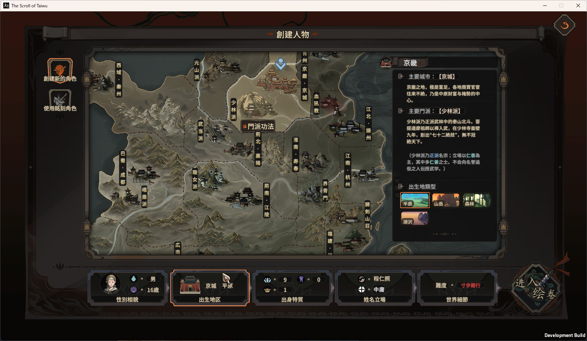

# 太吾绘卷 The Scroll Of Taiwu
日本語化というか簡体字を日本の漢字に変換して表示するまでを目的にしている。

対象ファイルリスト
<ul>
  <li>
    全てのイベントテキスト
    
    The Scroll Of Taiwu\Event\EventLanguages\*.txt
  </li>
  <li>
    The Scroll Of Taiwu\The Scroll of Taiwu_Data\GameResources\fonts.uab内のフォント
    <ul>
      <li>Font SDF BIG5 Core 1</li>
      <li>Font SDF BIG5 Core 2</li>
      <li>Font SDF GB2312</li>
    </ul>
  </li>
  <li>
    下記ファイル内の全てのテキストアセット
    <ul>
      <li>The Scroll Of Taiwu\The Scroll of Taiwu_Data\GameResources\encyclopedia.uab</li>
      <li>The Scroll Of Taiwu\The Scroll of Taiwu_Data\GameResources\language_cn.uab</li>
      <li>The Scroll Of Taiwu\The Scroll of Taiwu_Data\GameResources\language_eventoptiontips.uab</li>
    </ul>
  </li>
  <li>
    下記ファイル内のMonoBehaviourの一部
    <ul>
      <li>The Scroll Of Taiwu\The Scroll of Taiwu_Data\GameResources\views.uab</li>
      <li>The Scroll Of Taiwu\The Scroll of Taiwu_Data\GameResources\sort.uab</li>
    </ul>
    ここに書くには対象ファイルが多すぎるので.\uabの各ディレクトリを参照
  </li>
  <li>
    The Scroll Of Taiwu\The Scroll of Taiwu_Data\Managed\Assembly-CSharp.dllのソースに定数として記述している
    <ul>
      <li>The Scroll Of Taiwu\Assembly-CSharp\GMCombatEditor.cs</li>
      <li>The Scroll Of Taiwu\Assembly-CSharp\GMCombatSkillEditor.cs</li>
      <li>The Scroll Of Taiwu\Assembly-CSharp\GMLifeSkillEditor.cs</li>
      <li>The Scroll Of Taiwu\Assembly-CSharp\MouseTipBook.cs</li>
      <li>The Scroll Of Taiwu\Assembly-CSharp\UI_CombatAiConsole.cs</li>
      <li>The Scroll Of Taiwu\Assembly-CSharp\UI_GMWindow.cs</li>
      <li>The Scroll Of Taiwu\Assembly-CSharp\UI_LifeSkillBattle.cs</li>
      <li>The Scroll Of Taiwu\Assembly-CSharp\AdventureEditor\Beta\AdventureBranchEditor.cs</li>
      <li>The Scroll Of Taiwu\Assembly-CSharp\AdventureEditor\Beta\AdventureBrowser.cs</li>
      <li>The Scroll Of Taiwu\Assembly-CSharp\AdventureEditor\Beta\AdventureNodeEditor.cs</li>
      <li>The Scroll Of Taiwu\Assembly-CSharp\AdventureEditor\Beta\AdventureOpenItemCoreEditor.cs</li>
      <li>The Scroll Of Taiwu\Assembly-CSharp\AdventureEditor\Beta\AdventureSummaryInfo.cs</li>
      <li>The Scroll Of Taiwu\Assembly-CSharp\AdventureEditor\Beta\UI_AdventureEditor.cs</li>
      <li>The Scroll Of Taiwu\Assembly-CSharp\Config\LocalMonasticTitles.cs</li>
      <li>The Scroll Of Taiwu\Assembly-CSharp\Config\LocalNames.cs</li>
      <li>The Scroll Of Taiwu\Assembly-CSharp\Config\LocalSurnames.cs</li>
      <li>The Scroll Of Taiwu\Assembly-CSharp\Config\LocalTownNames.cs</li>
      <li>The Scroll Of Taiwu\Assembly-CSharp\Config\LocalZangNames.cs</li>
      <li>The Scroll Of Taiwu\Assembly-CSharp\Config\MapBlock.cs</li>
    </ul>
  </li>
</ul>

# 表示例
テキストを簡体字から日本の文字に変換し上記の全てに対応すると下の様にボタンのテキストまで全て日本の文字で表示できる。

uabファイルに外出しされているアセットはともかくAssembly-CSharp.dllの書き換えだけはやりたくなかったがどうにもならなかった。

公式がテキストを全て外出しにしてくれないものだろうか…

# To Do
<ul>
  <li>
    ローディング画面の下部のプログレスバーとその下の文章はメインとは違うフォントを使っているらしく、ここだけ□に化けている。
  </li>
</ul>

